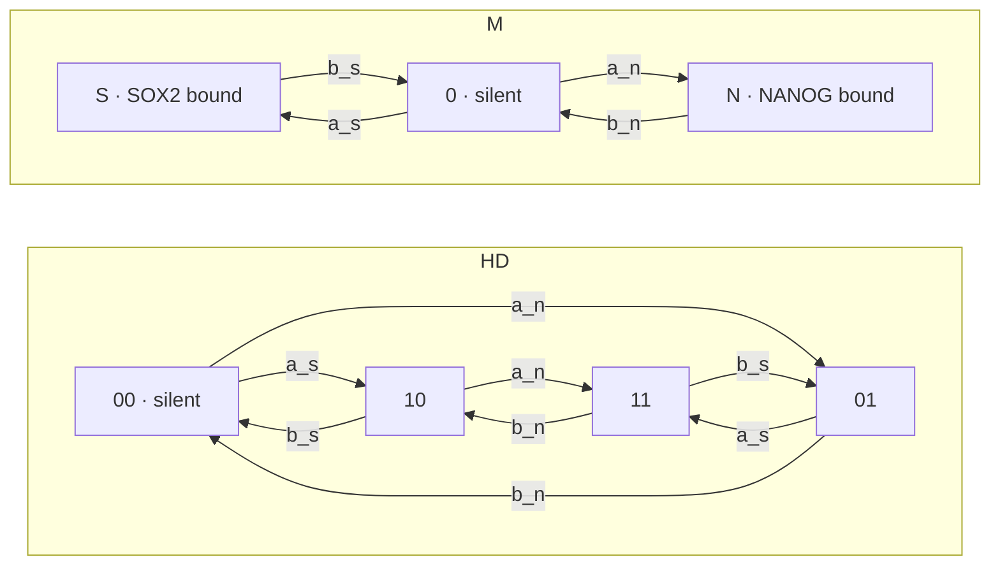

# stochastic modelling of NANOG/SOX2 gene expression


Code accompanying:

> G. G. Agsu et al., "Protein-protein interactions drive differences in the
> spatiotemporal dynamics of transcription factors NANOG and SOX2 in naïve
> pluripotent cells," Dec. 2025.
> doi: [10.64898/2025.12.03.691924](https://doi.org/10.64898/2025.12.03.691924)

## What this is

In mouse embryonic stem cells, SOX2 and NANOG regulate the same pluripotency
targets. *How* they share a promoter is not settled, and two architectures are
on the table:

- **HD — two independent sites.** Each factor binds its own site, and the gene
  transcribes whenever at least one site is occupied.
- **M — one contested site.** The factors compete for a single site and are
  never co-bound.

These are different Markov chains, and they leave different fingerprints in the
distribution of mRNA counts across single cells. `stochtf` works out those
fingerprints — in closed form where one exists, by exact solution of the
chemical master equation where it does not — and fits both architectures to
allele-resolved single-cell counts to see which the data support.



mRNA is produced at rate `k_tx` from every active state and degrades at rate
`gamma` per molecule. Under the OR gate the active set is `{10, 01, 11}` for HD
and `{S, N}` for M — so the two topologies differ only in whether the factors
can be bound at the same time, which is exactly the question the counts are
asked to settle.

## Install

```bash
git clone https://github.com/pacifistsilver/agsu_et_al_2025_mechanistic_models.git
```

```bash
cd agsu_et_al_2025_mechanistic_models && pip install -e .
```

```bash
pip install -e ".[inference]"
```

```bash
pip install -e ".[all]"
```

### Docker

```bash
docker build -t stochtf .
```

```bash
docker run --rm -it -v $(pwd):/app stochtf python figures/fig04_f_over_gamma.py
```

## Usage

### Simulate a trajectory

```bash
python scripts/run_ssa.py --model heterodimer
```

```bash
python scripts/run_ssa.py --model monomer --t-max 100 --out-dir /tmp
```

`--model` takes `monomer`, `homodimer` or `heterodimer`. Each writes a
time-course plot and prints the ON/OFF statistics extracted from the run.

### Bayesian Inference

```bash
python scripts/run_inference.py --gene esrrb --model heterodimer
```

```bash
python scripts/run_inference.py --gene sox2 --model joint
```

`--gene` takes `sox2`, `nanog`, `rex1`, `esrrb`, or any of the `synthetic_*`
datasets under `data/synthetic/` for validating the fit against parameters
known in advance. `--model` takes `monomer` (one contested site),
`heterodimer` (two independent sites), or `joint`.

`joint` now takes the model itself a parameter. 
`model_index` is 0 for the monomer and 1 for the heterodimer, SMC moves
between them, and the posterior mean of the index *is* P(heterodimer | data).
Both topologies carry the same five rates under the same priors. Traces are written to
`results/<gene>_<model>.nc`.

### Notebooks

`notebooks/` holds the exploratory work: monomer noise (`01`), steady-state
binding (`02`), NANOG/SOX2 count histograms (`03`), CV² against the mean (`04`)
and posterior diagnostics for the fits (`05`).

## Data

Raw counts are allele-resolved single-cell RNA-seq from mouse ES cells, GEO
accession
[GSE132589](https://www.ncbi.nlm.nih.gov/geo/query/acc.cgi?acc=GSE132589)
(Ochiai et al.). The two ~99 MB tables are downloaded rather than committed:

```bash
python scripts/download_data.py
```

Per-gene count vectors (`data/processed/*.npy`) and the synthetic validation
sets (`data/synthetic/*.npy`) are tracked, so the fits and figures run without
the download. See [data/README.md](data/README.md) for the full pipeline and a
known gap in it: `scripts/prepare_alleles.py` stops after building the
transcript-to-symbol map, so the processed arrays cannot currently be
regenerated end to end from the raw tables.

## Layout

```text
├── src/stochtf/          installed package
│   ├── analytical/       closed-form + FSP results for two-site promoters
│   │                     (pgf, gates, heterodimer, monomer, dimer, bursts, mfpt)
│   ├── ssa/              Gillespie simulator, parameters, promoter models
│   ├── cme/              chemical master equation solver (FSP)
│   ├── inference/        exact likelihood, SMC models, identifiability
│   ├── plotting.py       shared figure style, palette, output paths
│   └── paths.py          project directory resolution
├── figures/              one script per paper figure -> figures/output/
├── scripts/              misc. code to run inference, download data, etc.
├── notebooks/            exploratory and diagnostic notebooks
├── tests/                pytest suite
└── data/                 processed and synthetic data (raw is downloaded)
```

## Citing

See [CITATION.cff](CITATION.cff). Please cite both the paper and the software.

## License

MIT — see [LICENSE](LICENSE).
