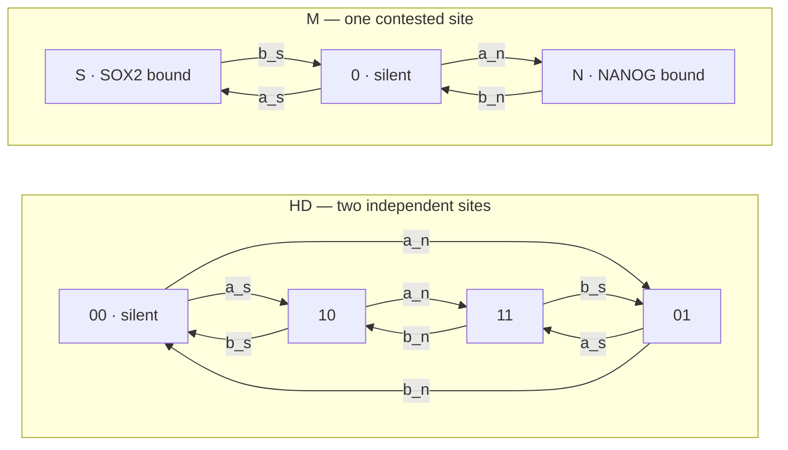
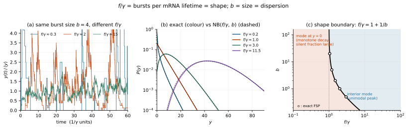
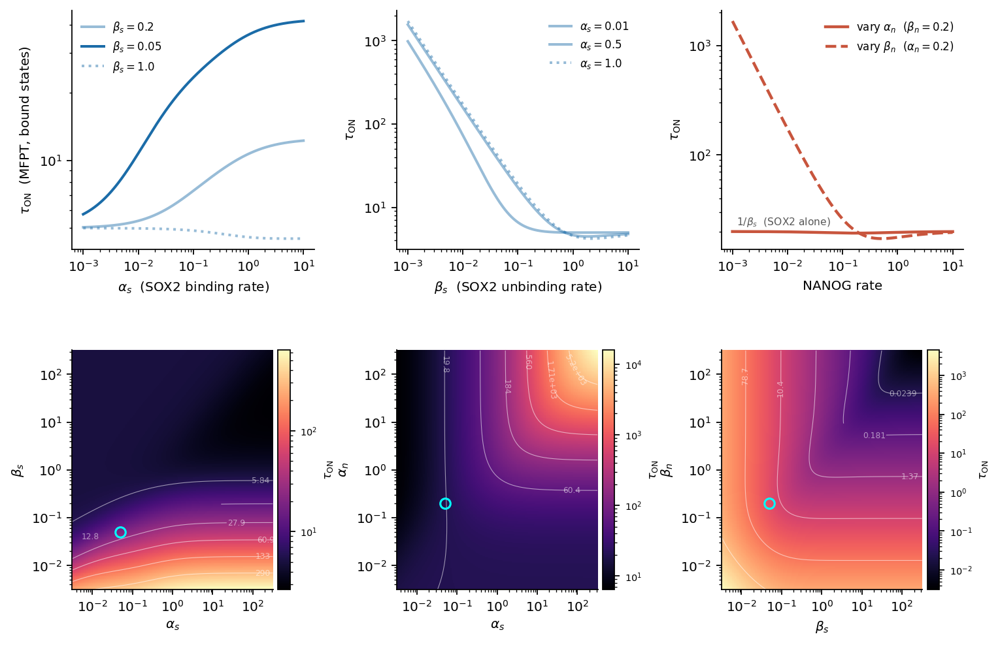

# stochtf — stochastic modelling of NANOG/SOX2 dynamics in gene expression noise


Code accompanying:

> G. G. Agsu et al., "Protein-protein interactions drive differences in the
> spatiotemporal dynamics of transcription factors NANOG and SOX2 in naïve
> pluripotent cells," Dec. 2025.
> doi: [10.64898/2025.12.03.691924](https://doi.org/10.64898/2025.12.03.691924)

## What this is

In mouse embryonic stem cells, SOX2 and NANOG regulate the same pluripotency
targets. *How* they share a promoter is not settled, and two architectures are
on the table:

- **HD — two independent sites.** Each factor binds its own site, and the gene
  transcribes whenever at least one site is occupied.
- **M — one contested site.** The factors compete for a single site and are
  never co-bound.

These are different Markov chains, and they leave different fingerprints in the
distribution of mRNA counts across single cells. `stochtf` works out those
fingerprints — in closed form where one exists, by exact solution of the
chemical master equation where it does not — and fits both architectures to
allele-resolved single-cell counts to see which the data support.



mRNA is produced at rate `k_y` from every active state and degrades at rate
`gamma` per molecule. Under the OR gate the active set is `{10, 01, 11}` for HD
and `{S, N}` for M — so the two topologies differ only in whether the factors
can be bound at the same time, which is exactly the question the counts are
asked to settle.

## Goals

1. **Predict, don't just simulate.** Give each architecture's stationary count
   distribution exactly — closed-form occupancies, burst frequency and size,
   and the Fano factor where they exist; finite state projection where they do
   not. Simulation is kept as a check on the algebra, not as the source of it.
2. **Decide between the architectures from data.** Fit both to allele-resolved
   counts for *sox2*, *nanog*, *rex1* and *esrrb* by sequential Monte Carlo,
   and validate the machinery against synthetic data generated from known
   parameters.
3. **Be honest about identifiability.** Stationary counts fix rates only in
   units of the mRNA degradation rate `gamma`, which is therefore held at 1 and
   never reported as inferred.
4. **Reproduce every figure from source**, with one script per figure and a
   single shared style module.

## Results at a glance

**Burst frequency per mRNA lifetime is the shape parameter.** `f/gamma` — how
many bursts arrive before a transcript decays — sets the shape of the count
distribution: large `f/gamma` gives a near-Poisson peak, small `f/gamma` gives
the long-tailed, over-dispersed distribution seen in the data. Everything else
about the promoter enters only through the burst size `b`.



```bash
python figures/fig04_f_over_gamma.py
```

**How long the promoter stays on.** The mean first-passage time out of the
bound states, `tau_ON`, across the binding and unbinding rates of both factors.
The upper row varies one rate at a time; the lower row is the full plane, with
the parameters implied by single-molecule tracking marked.



The MFPT calculation lives in `figures/fig_1_mfpt_heatmaps.py`, which writes
`figures/output/fig_1_mfpt.svg`; the panel above is the tracked copy of the
same quantity.

> [!WARNING]
> **`main` does not currently import.** Fifteen tracked files still carry
> unresolved merge-conflict markers — among them `src/stochtf/paths.py`,
> `src/stochtf/inference/models.py` and five of the seven figure SVGs in
> `figures/output/`. Until they are resolved, `import stochtf` raises
> `SyntaxError` and none of the commands below will run. The `abc-smc` branch
> is free of them; `git grep -l '^<<<<<<< '` lists the affected files.

## Install

```bash
git clone https://github.com/pacifistsilver/Srinjan_Modelling.git
```

```bash
cd Srinjan_Modelling && pip install -e .
```

Installing the package is what makes every script runnable from any working
directory. The core install covers the analytical results, the SSA, the CME
solver and the figures. The Bayesian inference stack is a heavier extra:

```bash
pip install -e ".[inference]"
```

```bash
pip install -e ".[all]"
```

### Docker

```bash
docker build -t stochtf .
```

```bash
docker run --rm -it -v $(pwd):/app stochtf python figures/fig04_f_over_gamma.py
```

## Quick start

Four commands, one per layer of the project:

```bash
python -c "from stochtf.analytical import heterodimer as hd; print(hd.fano(0.5, 0.05, 0.3, 0.2, k_y=30.0, gamma=1.0))"
```

```bash
python scripts/run_ssa.py --model heterodimer
```

```bash
python scripts/run_fsp.py heterodimer
```

```bash
python scripts/run_abc_smc.py --gene esrrb --model dimer
```

The first prints the exact Fano factor with no simulation at all; the second
simulates one trajectory and writes a time-course plot to `results/`; the third
solves the master equation by finite state projection; the fourth fits the
model to real counts and writes a trace to `results/esrrb_dimer.nc`.

## Usage

### Analytical results

Every quantity below is exact — no truncation, no Monte Carlo. Rates are in
units of `gamma`.

```python
from stochtf.analytical import heterodimer as hd

p = dict(a_s=0.5, b_s=0.05, a_n=0.3, b_n=0.2)   # SOX2 on/off, NANOG on/off

hd.pbound(**p)                        # P(at least one site occupied)
hd.burst_frequency(**p)               # f = 1 / (<T_on> + <T_off>)
hd.burst_size(**p, k_y=30.0)          # b = k_y <T_on>
hd.mean_y(**p, k_y=30.0, gamma=1.0)   # <y> = b f / gamma
hd.fano(**p, k_y=30.0, gamma=1.0)     # exact Fano factor, N-independent
```

The same four-state promoter under all three emission rules, mean and Fano side
by side:

```python
from stochtf.analytical import gates

for gate in ("OR", "AND", "ADD"):
    mean, fano = gates.analytic(0.5, 0.05, 0.3, 0.2, k=30.0, g=1.0, gate=gate)
    print(f"{gate:>3}  mean {mean:7.2f}  Fano {fano:6.2f}")
```

`gates.fsp(...)` returns the full stationary distribution for any of the three
gates and `gates.moments(P)` reduces it to `(mean, variance, Fano)` — the
independent check that the closed forms above are right.

Two results generalise past the two-site promoter: `analytical.dimer` gives the
exact Fano factor for *any* autonomous promoter-and-pool driver, bimolecular
dimerisation included, and `analytical.bursts` gives burst frequency and size
for any driver chain, verifying `<y> = b f / gamma` in each case.

### Simulate a trajectory

```bash
python scripts/run_ssa.py --model heterodimer
```

```bash
python scripts/run_ssa.py --model monomer --t-max 100 --out-dir /tmp
```

`--model` takes `monomer`, `homodimer` or `heterodimer`. Each writes a
time-course plot and prints the ON/OFF statistics extracted from the run.

### Solve the master equation

```bash
python scripts/run_fsp.py burr08 --expander support
```

```bash
python scripts/run_fsp.py heterodimer
```

The positional argument selects the network (`burr08`, `heterodimer`,
`homodimer`); `--expander` chooses between the `simple` and `support`
state-space expanders.

### Fit to data

```bash
python scripts/run_abc_smc.py --gene esrrb --model dimer
```

```bash
python scripts/run_abc_smc.py --gene sox2 --model monomer --draws 200
```

`--gene` takes `sox2`, `nanog`, `rex1` or `esrrb`; `--model` takes `monomer`
(one contested site) or `dimer` (two independent sites). Traces are written to
`results/<gene>_<model>.nc` and analysed in
`notebooks/05_abc_diagnostics.ipynb`.

`scripts/run_inference.py` is the same fit scored against the exact stationary
likelihood rather than a simulator, which removes the ABC tolerance. It also
accepts the `synthetic_*` datasets under `data/synthetic/`, for validating the
fit against parameters that are known in advance.

### Figures

```bash
python figures/fig04_f_over_gamma.py
```

Each script writes an SVG into `figures/output/`. See
[figures/README.md](figures/README.md) for the script-to-figure map and a note
on the numbering, which still needs confirming against the manuscript.

`figures/standalone_f_over_gamma.py` needs only numpy, scipy and matplotlib —
no install, no package import — and is the self-contained reference for the
`f/gamma` result.

### Notebooks

`notebooks/` holds the exploratory work: monomer noise (`01`), steady-state
binding (`02`), NANOG/SOX2 count histograms (`03`), CV² against the mean (`04`)
and posterior diagnostics for the fits (`05`).

## Data

Raw counts are allele-resolved single-cell RNA-seq from mouse ES cells, GEO
accession
[GSE132589](https://www.ncbi.nlm.nih.gov/geo/query/acc.cgi?acc=GSE132589)
(Ochiai et al.). The two ~99 MB tables are downloaded rather than committed:

```bash
python scripts/download_data.py
```

Per-gene count vectors (`data/processed/*.npy`) and the synthetic validation
sets (`data/synthetic/*.npy`) are tracked, so the fits and figures run without
the download. See [data/README.md](data/README.md) for the full pipeline and a
known gap in it: `scripts/prepare_alleles.py` stops after building the
transcript-to-symbol map, so the processed arrays cannot currently be
regenerated end to end from the raw tables.

## Tests

```bash
pytest
```

```bash
pytest -m "not slow"
```

`tests/test_analytical.py` checks the identities the analytical module must
satisfy: `f = 1/(T_on + T_off)`, `<y> = b f / gamma`, the closed-form Fano
factor against exact FSP, and the single-site limits. `tests/test_gillespie.py`
checks the simulator against them in turn.

Three further modules — `test_pgf.py`, `test_likelihood.py` and
`test_identifiability.py` — are tracked on this branch but import modules that
are not (`analytical.pgf`, `inference.likelihood`, `inference.identifiability`),
so they collect as errors until those are merged in from `abc-smc`.
`test_models.py` imports resolve, but fail with the rest of the suite while
`inference/models.py` carries conflict markers.

## Layout

```text
├── src/stochtf/          installed package
│   ├── analytical/       closed-form + FSP results for two-site promoters
│   ├── ssa/              Gillespie simulator, parameters, promoter models
│   ├── cme/              chemical master equation solver (FSP)
│   ├── inference/        SMC models and numba simulators
│   ├── plotting.py       shared figure style, palette, output paths
│   └── paths.py          project directory resolution
├── figures/              one script per paper figure -> figures/output/
├── scripts/              entry points (download, prepare, run, fit)
├── notebooks/            exploratory and diagnostic notebooks
├── tests/                pytest suite
└── data/                 processed and synthetic arrays (raw is downloaded)
```

## Citing

See [CITATION.cff](CITATION.cff). Please cite both the paper and the software.

## License

MIT — see [LICENSE](LICENSE).
